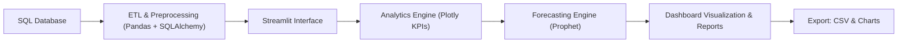

# MarketIQ, Real-Time Sales & Forecasting Dashboard

**MarketIQ** is a full-featured **Streamlit-powered analytics platform** that integrates **SQL-driven data pipelines**, **interactive visualization**, and **AI-powered forecasting**.  
It empowers analysts, startups, and data teams to turn raw data into actionable business insights, in real-time.

---

## Project Overview

MarketIQ provides a **data storytelling environment** for operational analytics, business intelligence, and forecasting.  
It connects seamlessly to SQL databases, allowing users to explore KPIs like revenue, orders, and customer engagement dynamically.  
With built-in **Prophet forecasting**, it projects future trends based on historical sales.

This system simulates what modern analytics teams need: real-time querying, rapid visualization, and human-readable insights.

---

## Architecture Overview


This modular architecture promotes extensibility, allowing users to integrate new models, connect external databases (PostgreSQL, Supabase), or automate reporting pipelines.

---

## Technology Stack

| Layer | Technology | Purpose |
|-------|-------------|----------|
| **Frontend** | Streamlit | Interactive UI and visualization |
| **Database Layer** | SQLite (default) / PostgreSQL-ready | Centralized analytics data |
| **Data Processing** | Pandas + SQLAlchemy | Query execution and data transformations |
| **Visualization** | Plotly Express | Dynamic charts and interactive KPIs |
| **Forecasting** | Prophet (optional) | Predictive time-series analysis |
| **Language** | Python 3.10+ | Core application logic |

---

## Features

**SQL-powered Metrics:** Directly query and visualize your database.  
**KPI Dashboard:** Revenue, Orders, Customers, AOV, and MoM trends.  
**Forecast Module:** Prophet predicts future sales with confidence intervals.  
**Multi-view Charts:** Line, Bar, and Donut charts with Plotly.  
**Real-Time Filters:** Date range filters update every chart dynamically.  
**Export Tools:** Save results as CSV or images for reports.  
**Extendable System:** Add new SQL models or ML forecasts easily.

---

## Project Structure

```
marketiq/
├── app.py                  # Streamlit app logic
├── marketiq/               # Core Python package
│   ├── db.py               # SQLAlchemy connection + query layer
│   ├── queries.py          # SQL queries for KPI, channels, products
│   ├── charts.py           # Plotly charting utilities
│   ├── forecast.py         # Prophet forecasting
├── marketiq.db             # Preloaded SQLite database
└── requirements.txt        # Dependencies

```

---

## Setup & Installation

```bash
# Clone the repo
git clone https://github.com/AmirhosseinHonardoust/MarketIQ.git
cd MarketIQ

# Install dependencies
pip install -r requirements.txt

# (Optional) Enable Prophet forecasting
pip install prophet pystan==2.19.1.1

# Launch the dashboard
streamlit run app.py
```

---

## Visual Walkthrough

### 1. Dashboard Overview


**Description:**  
This is the main interface of MarketIQ. It includes global KPIs, dynamic charts, and real-time filters for start and end date selection.

**Insight:**  
Analysts can view key performance metrics at a glance, revenue, orders, customer base, and AOV, without running manual queries.

**Technical Note:**  
KPIs are aggregated from `v_sales_monthly` view via SQLAlchemy and rendered dynamically with Streamlit metric components.

---

### 2. Revenue & Orders Over Time


**Description:**  
This line chart visualizes **revenue and orders** per month, showcasing sales trends over time.

**Insight:**  
Peaks correspond to strong seasonal demand, while dips reflect slower periods, useful for marketing and operations forecasting.

**Technical Note:**  
Computed via SQL aggregation, transformed with Pandas, and rendered using Plotly Express `px.line()` with `markers=True` for trend clarity.

---

### 3. Channel Revenue Distribution


**Description:**  
This donut chart shows the proportion of total revenue contributed by each sales channel (Web, Mobile, Retail, Marketplace).

**Insight:**  
Reveals channel dependency, if “Web” dominates, the business might diversify into app or retail strategies.

**Technical Note:**  
Query from `v_sales` grouped by `channel_name`; rendered with `px.pie(..., hole=0.5)` for donut-style view.

---

### 4. Top Products by Revenue


**Description:**  
A horizontal bar chart ranking top-performing products by revenue.

**Insight:**  
Identifies which SKUs or categories drive the majority of sales, a key tool for inventory planning and marketing.

**Technical Note:**  
Top 15 rows fetched via SQL query ordered by `SUM(revenue)`; plotted using Plotly’s `px.bar()` with orientation='h'.

---

### 5. Forecast Section

**Description:**  
Displays Prophet-based forecasts for upcoming months based on historical revenue data.

**Insight:**  
Provides predictive foresight into potential sales outcomes, helping teams allocate budgets or prepare inventory.

**Technical Note:**  
Uses Prophet’s additive model for trend + seasonality. The `make_future_dataframe(periods=6, freq='MS')` generates 6-month forecasts with upper/lower confidence bounds.

---

## Data Model (SQL Schema)

MarketIQ’s SQL schema follows a **star model**, with one fact table (`fact_sales`) and supporting dimensions.  

| Table | Purpose |
|--------|----------|
| **dim_date** | Stores calendar metadata (month, year, week) |
| **dim_product** | Catalog of products with category hierarchy |
| **dim_customer** | Customer attributes for segmentation |
| **dim_channel** | Sales channels (web, app, retail) |
| **fact_sales** | Central transactional table (quantities, prices, revenue) |

Two SQL **views** simplify analytics:
- `v_sales` joins all dimensions → detailed transactional reporting  
- `v_sales_monthly` aggregates customer revenue by month → KPI-ready dataset  

---

## KPI Logic

| Metric | Formula | Description |
|--------|----------|--------------|
| **Revenue** | `SUM(quantity * price * (1 - discount/100))` | Total sales revenue |
| **Orders** | `COUNT(sale_id)` | Number of transactions |
| **Customers** | `COUNT(DISTINCT customer_id)` | Active customers in period |
| **AOV** | `AVG(revenue / orders)` | Average Order Value |
| **MoM Growth** | `(Current - Previous) / Previous * 100` | Month-over-Month growth |

---

## Forecasting Engine (Prophet)

MarketIQ integrates **Prophet** for interpretable, scalable time-series forecasting.

- **Trend Component:** Captures long-term revenue trajectory.  
- **Seasonality Component:** Adjusts for monthly and yearly patterns.  
- **Confidence Intervals:** Upper/lower bounds reflect uncertainty.  

If Prophet is not installed, MarketIQ gracefully disables forecasting but remains fully functional for SQL-driven analytics.

---

## Exports

All generated insights can be saved as CSV or PNG for sharing or archiving.

Example:
```
export/2025-11-05T12-14_export.csv
```

This file includes all filtered KPI data and model results used in the dashboard at that timestamp.

---

## Future Enhancements

- **RFM & Cohort Analysis:** Customer segmentation for retention tracking.  
- **Anomaly Detection:** ML-based detection of irregular revenue spikes.  
- **Multi-DB Support:** PostgreSQL, Supabase, or DuckDB for scalability.  
- **Automated PDF Reporting:** Generate shareable analytics reports.  
- **Interactive SQL Editor:** Run ad-hoc queries directly in Streamlit.  
